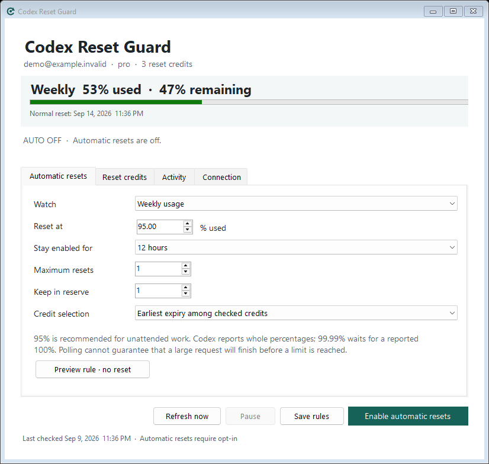
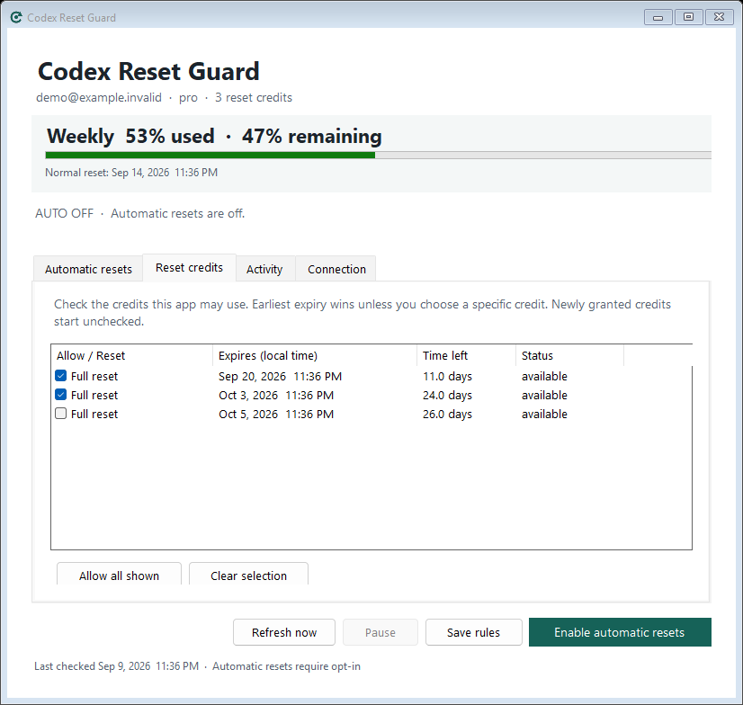

# Codex Reset Guard

**Your banked Codex resets, used by your rules.** A small, portable Windows tray app that redeems existing reset credits when usage reaches a threshold you choose.

[](https://github.com/JamesTsetsekas/CodexResetGuard/actions/workflows/build.yml)
[](https://github.com/JamesTsetsekas/CodexResetGuard/releases/latest)
[](LICENSE)

**[Download for Windows x64](https://github.com/JamesTsetsekas/CodexResetGuard/releases/latest)** · [User guide](docs/USER-GUIDE.md) · [Report a bug](https://github.com/JamesTsetsekas/CodexResetGuard/issues/new/choose)



*Real app, sample account. Automatic resets start disabled.*

## What it does

- **Explicit opt-in:** select allowed credits, choose your rules, then enable. New credits remain unchecked.
- **Use earlier expiries first:** automatically select the earliest-expiring allowed credit, or pin one specific credit.
- **Choose your threshold:** watch weekly, 5-hour, or either usage window. Default: 95% used.
- **Set a spending allowance:** limit the enabled period and number of resets, and keep credits in reserve.
- **Recover carefully:** persist each request before sending, reuse its idempotency key on retries, and verify refreshed usage before considering another credit.
- **Stay in the tray:** native Windows UI, optional launch at sign-in, and no installer or administrator requirement.

This redeems reset credits you already have. It does not purchase credits, switch accounts, or resume interrupted tasks. It is an independent project, unaffiliated with OpenAI.

## Get started

1. Install the official [Codex CLI](https://github.com/openai/codex) **0.147.0 or newer** and sign in with your ChatGPT account.
2. Download and extract the release ZIP. Keep `CodexResetGuard.exe` and its `.config` file together, then open the executable.
3. In **Reset credits**, check which credits the app may use.
4. In **Automatic resets**, set the threshold, enabled period, maximum resets, and reserve. Click **Enable automatic resets**.

Defaults are **off**, **95% weekly usage**, **12 hours**, **one reset maximum**, and **one credit in reserve**. If you only have one credit and want it usable, set the reserve to zero. Close the window to keep the tray app running; choose **Pause** to stop automatic redemption.

Requires Windows 10/11 x64, .NET Framework 4.8+, and file-backed ChatGPT authentication in Codex's existing `auth.json`. Keyring-only and API-key accounts are not supported in this version. Your PC must be awake and the app running. The executable is unsigned.

### Why 95%, rather than 99.99%?

Codex reports usage as whole percentages. **99.99% waits for a reported 100%**, which may be too late for an active request. A 95% threshold leaves headroom; 98–99% uses more of the allowance but leaves less time to react. Polling cannot guarantee uninterrupted sessions, especially with large or concurrent requests. See [thresholds and recovery](docs/USER-GUIDE.md#choosing-a-threshold).

## Credit control



Only checked, available full-reset credits are eligible. A specific-credit selection never falls back to another credit. A pending request blocks use of another credit until it is reconciled. Account changes pause automation. Expiring credits and imminent natural resets are checked before redemption; the server makes the final eligibility decision.

## How it works

The app starts its own hidden official `codex app-server --listen stdio://` process and uses the account APIs to read usage and redeem the selected credit. It never starts a model turn or replaces the running Codex desktop app.

Settings and the recovery journal stay in `%LOCALAPPDATA%\CodexResetGuard\state.json`. The existing Codex auth file is read in memory to bind automation to a hashed account identity. Reset Guard does not store tokens, send telemetry, or use a third-party account service. The official Codex process handles its normal authentication. See the [privacy and recovery details](docs/USER-GUIDE.md).

## Build and test

No package restore or separate .NET SDK is required. From Windows PowerShell:

```powershell
.\source\Build.ps1 -OutDir .\build
.\build\CodexResetGuard.Tests.exe
```

The build uses the C# compiler included with .NET Framework. Tests use an isolated fake reset service, including the actual stdio transport. They do not consume credits. To produce the tested portable ZIP and SHA-256 manifest:

```powershell
.\scripts\Release.ps1 -Version 1.0.0
```

UI verification uses `--ui-smoke <directory>` with synthetic data. Live connection verification uses `--read-only-check <report.json>` and cannot redeem credits. Details are in [CONTRIBUTING.md](CONTRIBUTING.md).

## References and inspiration

- [Codex app-server: earned rate-limit resets](https://learn.chatgpt.com/docs/app-server#8-earned-rate-limit-resets-chatgpt)
- [How banked Codex resets work](https://help.openai.com/en/articles/20001498-how-banked-codex-resets-work)
- [Official rate-limit types and percentage rounding](https://github.com/openai/codex/blob/main/codex-rs/app-server-protocol/src/protocol/v2/account.rs)
- [Win-CodexBar](https://github.com/nesszer/Win-CodexBar) and [CodexBar](https://github.com/steipete/CodexBar) inspired the tray-tool approach. Reset Guard is a separate implementation focused on opt-in reset redemption.

The app-server interface may change between Codex versions. Please include the CLI version when reporting compatibility issues.

If this saves you a manual reset, consider starring the repository or sharing a reproducible bug report. Contributions are welcome under the [MIT license](LICENSE).
